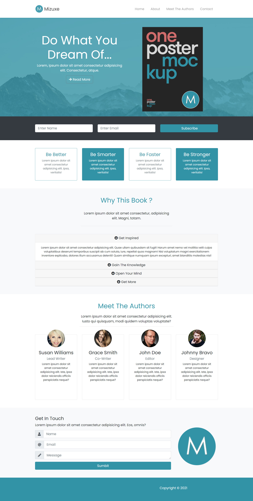

<!-- TABLE OF CONTENTS -->

Table of Contents

<ul>

<li><a  href="#about-the-project">About The Project</a>

<li><a  href="#built-with">Built With</a></li>

<li><a  href="#license">License</a></li>

<li><a  href="#contact">Contact</a></li>

</ul>

<!-- ABOUT THE PROJECT -->

## About The Project

A simple book promotion landing page using HTML, CSS, SASS and Bootstrap.
I have used various bootstrap classes such as nav, grid, flex, card, form and etc.

### Built With

- [HTML](https://en.wikipedia.org/wiki/HTML)

- [CSS](https://en.wikipedia.org/wiki/CSS)

- [Bootstrap](https://getbootstrap.com/)

- [SASS](https://sass-lang.com/)

<!-- LICENSE -->

## License

Distributed under the MIT License. See `LICENSE` for more information.

<!-- CONTACT -->

## Contact

Mustafa Kadan - [@mtevfik41](https://twitter.com/mtevfik41) - mtevfik41@gmail.com
